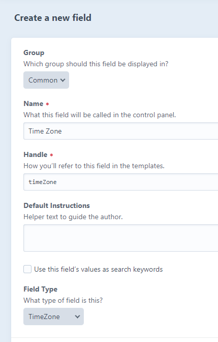
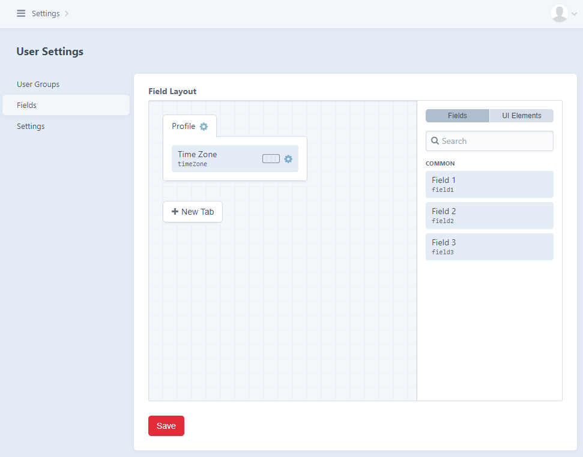

# Time Traveler plugin for Craft CMS 3.x

Add the time zone control on user level

## Requirements

This plugin requires Craft CMS 3.0.0-beta.23 or later.

## Installation

To install the plugin either install it through Plugin Store or tell Composer to load the plugin and then go to Settings → Plugins and click the “Install” button for Time Traveler.

        composer require frontend-services/time-traveler

## Time Traveler Overview

Time Traveler will add these three features to your Craft installation

1. Change timezone for date and time fields
2. Timezone field type with configurable list of timezones
3. Set different system time zone for each user

## Configuring Time Traveler

Create a file called `time-traveler.php` in your Craft's config folder and paste the following code: 
```injectablephp
<?php

return [
    '*' => [
        'timezoneList' => [
            'America/New_York' => 'Eastern Time',
            'America/Chicago' => 'Central Time',
            'America/Denver' => 'Mountain Time',
            'America/Phoenix' => 'Mountain Time (no DST)',
            'America/Los_Angeles' => 'Pacific Time',
            'America/Anchorage' => 'Alaska Time',
            'America/Adak' => 'Hawaii-Aleutian Time',
            'Pacific/Honolulu' => 'Hawaii-Aleutian Time (no DST)',
        ],
        'fieldName' => 'timeZone'
    ],
];
```

`timezoneList` option has the form `'[php time zone name]' => '[label]'`. List of all PHP time zones can be found [here](https://www.php.net/manual/en/timezones.php).

### User timezone selection

To allow users to select timezone follow these steps:
1. Create a new field of type TimeZone. If your new field's handle is different from `timeZone` you will have to update option value `fieldName` in `time-traveler.php` config file.



2. Add this newly created field to user's profile.



3. Now each user is allowed to select custom timezone. Timezone for the user will be changed for both frontend site and Craft admin, as long as the user is logged in.


## Time Traveler Roadmap

* Convert current field value instantly as user selects time zone from dropdown
* Frontend time zone selection for unregistered users
---
Plugin icon made by [Freepik](https://www.freepik.com) from [Flaticon](https://www.flaticon.com)