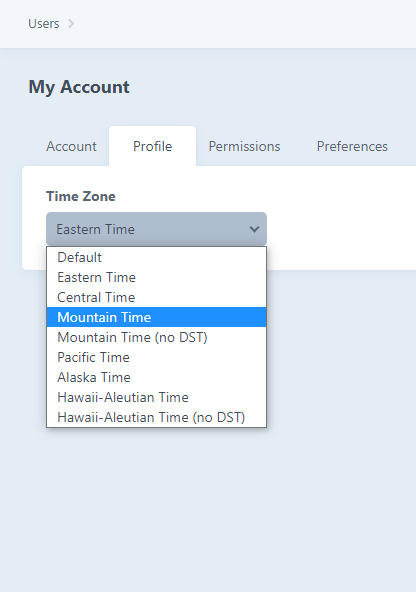

# Time Traveler plugin for Craft CMS 3.x

Allow users to change the time zone.

## Requirements

This plugin requires Craft CMS 3.0.0-beta.23 or later.

## Installation

To install the plugin either install it through Plugin Store or tell Composer to load the plugin and then go to Settings → Plugins and click the “Install” button for Time Traveler.

        composer require matotominac/time-traveler

## Time Traveler Overview

With Time Traveler plugin users will be able to select a timezone for their user account. When they select a timezone all dates will instantly be shown in their selected time zone, no need for any extra frontend conversion. Also everything they post that includes time will be posted in their time zone and propery converted to system's time zone.

 

When you enable the plugin all timezones will be available in the dropdown but you are in total control of selecting which timezones will show and you can also rename timezones to something nicer than default PHP timezone labels.

## Configuring Time Traveler

Create a file called `time-traveler.php` in your Craft's config folder and paste the following code.  
```injectablephp
<?php

return [
    '*' => [
        'timezoneList' => [
            'America/New_York' => 'Eastern Time',
            'America/Chicago' => 'Central Time',
            'America/Denver' => 'Mountain Time',
            'America/Phoenix' => 'Mountain Time (no DST)',
            'America/Los_Angeles' => 'Pacific Time',
            'America/Anchorage' => 'Alaska Time',
            'America/Adak' => 'Hawaii-Aleutian Time',
            'Pacific/Honolulu' => 'Hawaii-Aleutian Time (no DST)',
        ],
        'fieldName' => 'timeZone'
    ],
];
```

`timezoneList` option has the form `'[php time zone name]' => '[label]'`. List of all PHP time zones can be found [here](https://www.php.net/manual/en/timezones.php).

Two sample config files for US and Australian time zones are included in plugin's root folder, you can directly copy them to your Craft's config folder. Please do not forget to rename them to `time-traveler.php`.

### User timezone selection instructions

To allow users to select timezone follow these steps:
1. Create a new field of type TimeZone (this field type will be available when you enable the plugin). Plugin requires this field's handle to be set to `timeZone` but if you wish to have something different you will have to update the value of the option `fieldName` in your `time-traveler.php` config file (as shown in the snippet above).


2. Add this newly created field to user's profile.


3. That's all. Now every user is allowed to select custom timezone. Timezone for the user will be changed for both frontend site and Craft admin, as long as the user is logged in.


## FAQs
### Will this plugin work on already developed sites or are there any twig modifications necessary?
Yes, this plugin will work on any already existing site. All you need to do is enable the plugin, add the field to user's profile as described below and that's it, plugin will work out of the box, even on existing sites. No modifications are necesary in twig code for showing dates on frontend.

### Can I add the time zone selection field to frontend user profile edit form?
Absolutely. Time zone selection field is a field like any other custom field on user profile. Simply add the dropdown field with list of timezones and name it `fields[timeZone]` (or replace `timeZone` in case you renamed the field as shown above).

### Can I allow unregistered users to select a time zone?
Unfortunately not yet but that feature is on our roadmap.

## Time Traveler Roadmap

* Convert current field value instantly as user selects time zone from dropdown
* Frontend time zone selection for unregistered users
---
Plugin icon made by [Freepik](https://www.freepik.com) from [Flaticon](https://www.flaticon.com)